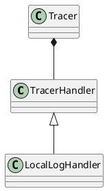
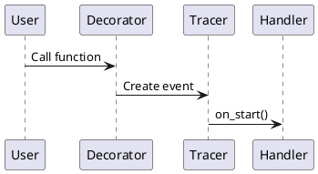

# Tracing 模块 PlantUML 图表说明文档

本文档说明 Tracing 模块的所有 PlantUML 图表的内容和用途。

## 目录结构

```
diagrams/
├── zh/                    # 中文版本图表
│   ├── class_diagram.puml
│   ├── sequence_diagram.puml
│   ├── component_diagram.puml
│   └── activity_diagram.puml
├── en/                    # 英文版本图表
│   ├── class_diagram.puml
│   ├── sequence_diagram.puml
│   ├── component_diagram.puml
│   └── activity_diagram.puml
└── README.md              # 本说明文档
```

## 图表类型说明

### 1. 类图 (Class Diagram)

**文件位置：**
- 中文：`zh/class_diagram.puml`
- 英文：`en/class_diagram.puml`

**内容说明：**
类图展示了 Tracing 模块的核心类及其关系，包括：

- **抽象类**：`TracerHandler` - 处理器接口
- **实现类**：`BaseLogHandler`、`LocalLogHandler` - 具体的处理器实现
- **核心类**：`Tracer`、`EventContext` - 追踪器核心组件
- **工具类**：`TracingUtil`、`TraceType` - 辅助工具
- **数据模型**：`LogContext`、`JsonFormatter` - 日志相关类

**关键关系：**
- `TracerHandler` 是抽象接口，`BaseLogHandler` 和 `LocalLogHandler` 实现该接口
- `Tracer` 使用 `TracerHandler` 列表（组合模式）
- `Tracer` 创建 `EventContext`，`EventContext` 使用 `TracerHandler`
- `LocalLogHandler` 使用 `LogContext` 和 `JsonFormatter`

**用途：**
- 理解模块的类结构
- 了解类之间的继承和组合关系
- 设计模式的应用（策略模式、组合模式）

### 2. 序列图 (Sequence Diagram)

**文件位置：**
- 中文：`zh/sequence_diagram.puml`
- 英文：`en/sequence_diagram.puml`

**内容说明：**
序列图展示了函数追踪的完整流程，包括以下阶段：

1. **函数调用阶段**：用户代码调用被装饰的函数
2. **初始化阶段**：初始化追踪上下文、提取参数、创建 Span
3. **事件开始阶段**：调用 Handler 的 `on_start` 方法
4. **函数执行阶段**：执行被装饰的函数，处理成功和异常情况
5. **事件结束阶段**：调用 Handler 的 `on_end` 方法，结束 Span

**关键参与者：**
- 用户代码
- @trace 装饰器
- wrapper.py（包装器）
- Tracer（追踪器）
- EventContext（事件上下文）
- LocalLogHandler（日志处理器）
- OpenTelemetry Span（分布式追踪 Span）
- 被追踪函数

**用途：**
- 理解追踪流程的时序关系
- 了解各组件之间的交互顺序
- 调试追踪问题时的参考

### 3. 组件图 (Component Diagram)

**文件位置：**
- 中文：`zh/component_diagram.puml`
- 英文：`en/component_diagram.puml`

**内容说明：**
组件图展示了 Tracing 模块的整体架构和组件依赖关系，包括：

- **用户代码层**：使用 Tracing 模块的应用代码
- **装饰器层**：@trace 装饰器
- **核心层**：wrapper.py、Tracer、EventContext
- **处理器层**：TracerHandler 接口及其实现
- **工具层**：TracingUtil、message_util、tracing_metric
- **OpenTelemetry 集成**：OT Tracer 和 Exporter
- **日志输出**：文件日志、控制台日志、JSON 格式化器

**关键依赖：**
- 用户代码依赖装饰器层
- 装饰器层依赖核心层
- 核心层依赖处理器层和工具层
- OpenTelemetry 集成导出到外部监控系统

**用途：**
- 理解模块的整体架构
- 了解组件之间的依赖关系
- 系统集成和扩展的参考

### 4. 活动图 (Activity Diagram)

**文件位置：**
- 中文：`zh/activity_diagram.puml`
- 英文：`en/activity_diagram.puml`

**内容说明：**
活动图展示了追踪过程的详细执行步骤和决策点，包括：

1. **函数类型检测**：根据函数类型选择对应的执行器
2. **初始化流程**：初始化追踪上下文、提取参数、验证选项
3. **Span 创建**：创建 OpenTelemetry Span 并设置属性
4. **Handler 处理**：调用 Handler 的开始方法
5. **函数执行**：区分普通函数和生成器函数的处理流程
6. **结果处理**：处理成功和异常两种情况
7. **清理工作**：结束 Span 和 Handler 处理

**关键决策点：**
- 函数类型判断（同步/异步/生成器）
- 执行成功/异常判断
- 第一个响应判断
- 完成原因检测

**用途：**
- 理解追踪过程的详细步骤
- 了解各种分支和决策逻辑
- 流程优化和问题排查的参考

## 如何使用这些图表

### 查看图表

1. **在线查看**：
   - 访问 [PlantUML 在线编辑器](http://www.plantuml.com/plantuml/uml/)
   - 复制 `.puml` 文件内容到编辑器
   - 查看渲染后的图表

2. **本地查看**：
   - 安装 PlantUML（需要 Java 环境）
   - 使用 VS Code 的 PlantUML 插件
   - 使用 IntelliJ IDEA 的 PlantUML 插件

3. **导出图片**：
   - 使用 PlantUML 命令行工具导出 PNG/SVG
   - 使用在线编辑器导出图片
   - 使用 IDE 插件导出图片

### 图表更新

当 Tracing 模块的代码发生变化时，需要同步更新相应的图表：

1. **类图更新**：当添加新类或修改类关系时
2. **序列图更新**：当修改追踪流程时
3. **组件图更新**：当添加新组件或修改依赖关系时
4. **活动图更新**：当修改执行流程或决策逻辑时

### 图表维护

- 保持中英文版本的一致性
- 确保图表内容与实际代码一致
- 定期检查图表的准确性
- 更新文档说明

## 图表渲染示例

### 类图示例



### 序列图示例



## 相关资源

- [PlantUML 官方文档](https://plantuml.com/)
- [UML 图表类型说明](https://plantuml.com/guide)
- [Tracing 模块分析报告](../ANALYSIS_REPORT.md)
- [Tracing 模块使用文档](../README.md)

## 贡献指南

如果您发现图表有错误或不完整，欢迎：

1. 提交 Issue 报告问题
2. 提交 Pull Request 修复问题
3. 提供改进建议

---

**最后更新**：2025-01-XX
**维护者**：Tracing 模块开发团队
